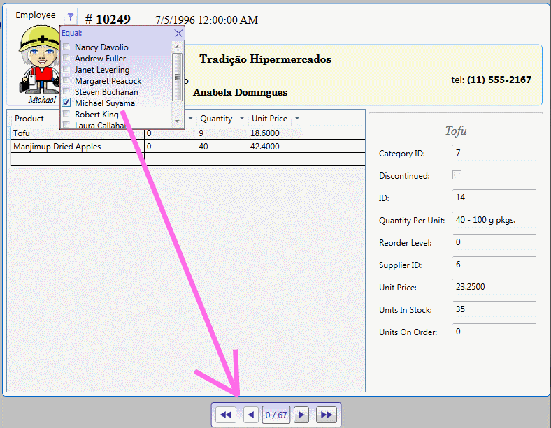

### Фильтрация элементов в пользовательском элементе управления. (OrdersView)
Как было сказано выше, `FilterPresenter` не взаимодействует с элементом управления `ItemsControl`
непосредственно. При внедрении `FilterControl` в пользовательский элемент управления достаточно, 
чтобы `FilterControl` был  подключен к тому же представлению коллекции, которое использует 
Ваш элемент управления. Для интерактивного использования быстрого фильтра необходимо,
чтобы Ваш элемент управления обрабатывал события изменения подключенной `CollectionView`.

Форма *OrdersView.xaml* представляет собой пользовательский элемент управления, 
выводящий результаты LINQ запроса к базе с использованием `CollectionView`. 
Для добавления фильтра достаточно в форму добавить `ColumnFilter`.
#### Как использовать
    <bsFilter:ColumnFilter Key="Employee"
        ParentCollection="{Binding DataContext.OrdersView,
            ElementName=LayoutRoot}">
    </bsFilter:ColumnFilter>
#### Как это выглядит

[Назад](Examle4.ProductsView.md "Использование представления коллекции c фильтром в нескольких местах. (ProductsView)") <<
[Оглавление](Readme.md) >>
[Вперед](Examle6.OrdersView.md "Фильтрация элементов в ComboBox. (OrdersView)")